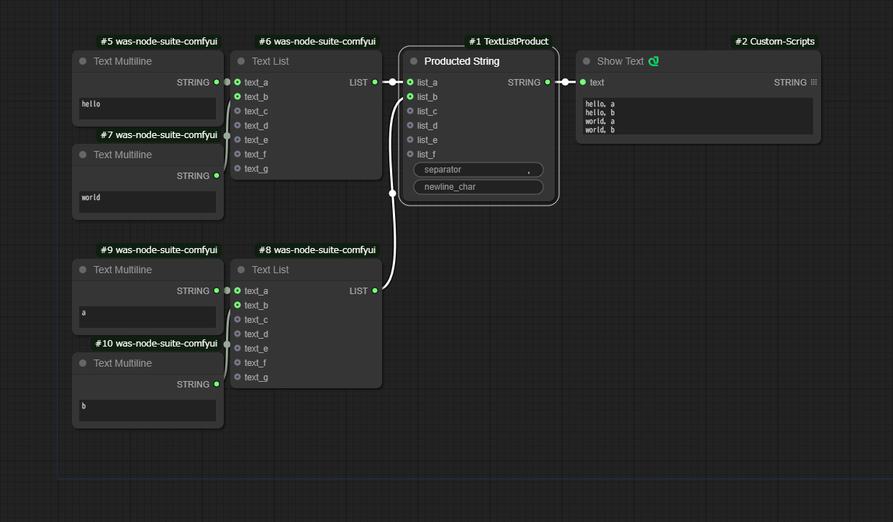

[日本語](#日本語) | [English](#english)

#### english

# Comfy UI Text List Product

This is a custom node for Comfy UI.

It mainly wraps `itertools.product` and can be used to create patterns by combining prompts.

It is recommended to install this custom node in combination with the nodes from the [WAS Node Suite](https://github.com/WASasquatch/was-node-suite-comfyui).

In the screenshot above, `[1girl, 1boy]` and `[blonde_hair, crown]` and `[beach, futuristic City]` are combined to create an 8-line (2 * 2 * 2) multiline string.

By connecting it to the WAS Node Suite's "Text Load Line From File" or the [CR Prompt List](https://github.com/Suzie1/ComfyUI_Comfyroll_CustomNodes/wiki/List-Nodes#cr-prompt-list) node from [ComfyUI_Comfyroll_CustomNodes](https://github.com/Suzie1/ComfyUI_Comfyroll_CustomNodes), you can generate 8 different patterns.

## Installation

It can be installed via Install Custom Nodes in the [ComfyUI Manager](https://github.com/ltdrdata/ComfyUI-Manager)

## Nodes

### ・ TextListProduct

This is a basic node. `TextListProduct` combines two lists and creates a new list joined by the specified separator.

### ・ TextListProductWithSingleA 
### ・ TextListProductWithSingleB
### ・ TextListProductWithSingleBoth

These nodes are shorthand nodes for when you want to use single words from one or both lists.

In other words, it is equivalent to passing an empty string at the beginning of the list passed to TextListProduct.

### ・ ProductedString

This is a further shorthand node for TextListProduct. It combines multiple lists and returns a multiline string with line breaks.

For general use, this node should work well.

## Usage Examples

You can use it to add a specified string at the beginning of the strings in the list.

Combine expression patterns * pose patterns * camera work patterns * ... and use the Save Text File node from the WAS Node Suite to generate a text file.

## License

MIT

#### 日本語
# Comfy UI Text List Product

Comfy UI のカスタムノードです。

主にitertools.productをラップしたもので、プロンプトをかけ合わせてパターンを作ることに利用できます。

[WAS Node Suite](https://github.com/WASasquatch/was-node-suite-comfyui)のノードと組み合わせることを想定しているので、こちらのカスタムノードもインストールすることを推奨します。

上のスクリーンショットでは、`[ 1girl, 1boy ]` と `[ blonde_hair, crown ]` と `[ beach, futuristic City ]` を掛け合わせて、8行(2 * 2 * 2)のマルチライン文字列を作っている様子です。

あとは、WAS Node SuiteのText Load Line From Fileや[ComfyUI_Comfyroll_CustomNodes](https://github.com/Suzie1/ComfyUI_Comfyroll_CustomNodes)の[CR Prompt List](https://github.com/Suzie1/ComfyUI_Comfyroll_CustomNodes/wiki/List-Nodes#cr-prompt-list)につなげることで、8パターンを生成することができます。
## インストール

[ComfyUI Manager](https://github.com/ltdrdata/ComfyUI-Manager)のInstall Custom Nodesからインストールできます。

## ノード

### ・ TextListProduct

基本的なノード。`TextListProduct` は、2つのリストを掛け合わせて、指定されたセパレータで結合した新しいリストを作成します。

#### ・ TextListProductWithSingleA 
#### ・ TextListProductWithSingleB 
#### ・ TextListProductWithSingleBoth

これらのノードは、片方、または両方のリストの単語単体を使いたいときのショートハンド用ノードです。

つまりTextListProductに渡すリストの先頭に空文字を渡した時と同じです。

### ・ ProductedString

さらにTextListProductのショートハンドノードです。複数のリストを掛け合わせて、改行を加えて複数行の文字列にして返します。

とりあえずこれを使えば間違いない。

## 使用例

リストの文字列の先頭に指定の文字列を加えたいとか。

表情パターン * ポーズパターン * カメラワークパターン * ... と組み合わせて、WAS Node SuiteのSave Text Fileノードを使って、文字列ファイルを生成するとか。

## Workflow

## License

MIT