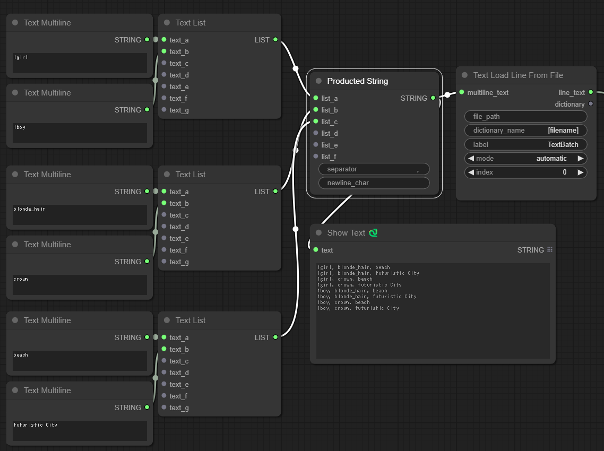
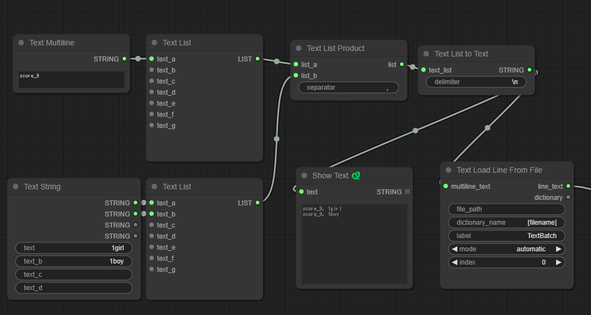
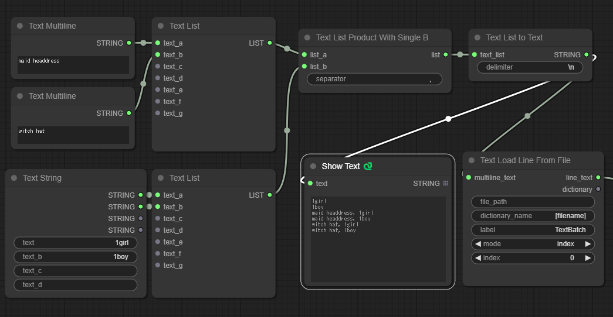
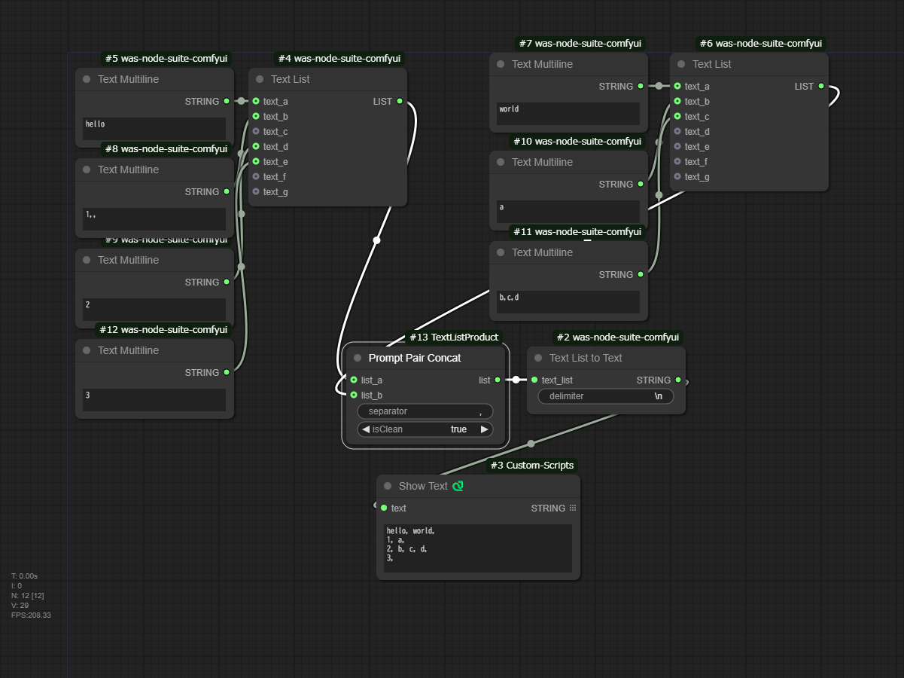
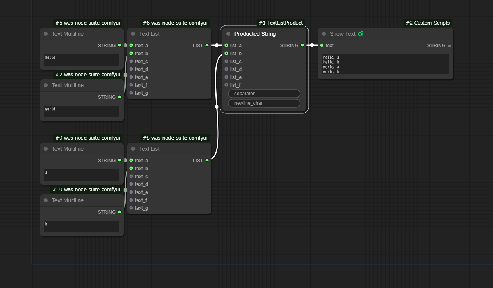

[日本語](#日本語) | [English](#english)

#### english

# Comfy UI Text List Product

This is a custom node for Comfy UI.

It mainly wraps `itertools.product` and can be used to create patterns by combining prompts.

It is recommended to install this custom node in combination with the nodes from the [WAS Node Suite](https://github.com/WASasquatch/was-node-suite-comfyui).

In the screenshot above, `[1girl, 1boy]` and `[blonde_hair, crown]` and `[beach, futuristic City]` are combined to create an 8-line (2 * 2 * 2) multiline string.

By connecting it to the WAS Node Suite's "Text Load Line From File" or the [CR Prompt List](https://github.com/Suzie1/ComfyUI_Comfyroll_CustomNodes/wiki/List-Nodes#cr-prompt-list) node from [ComfyUI_Comfyroll_CustomNodes](https://github.com/Suzie1/ComfyUI_Comfyroll_CustomNodes), you can generate 8 different patterns.

## Installation

It can be installed via Install Custom Nodes in the [ComfyUI Manager](https://github.com/ltdrdata/ComfyUI-Manager)

## Nodes

### ・ TextListProduct

This is a basic node. `TextListProduct` combines two lists and creates a new list joined by the specified separator.

`max_results` can be used to stop generation early when the cartesian product would become too large. `0` means unlimited.

### ・ TextListProductWithSingleA 
### ・ TextListProductWithSingleB
### ・ TextListProductWithSingleBoth

These nodes are shorthand nodes for when you want to use single words from one or both lists.

In other words, it is equivalent to passing an empty string at the beginning of the list passed to TextListProduct.

These nodes also support `max_results` to cap the number of generated combinations.

### ・ ProductedString

This is a further shorthand node for TextListProduct. It combines multiple lists and returns a multiline string with line breaks.

For general use, this node should work well.

`max_results` can be used here as well to cap the number of generated lines.

### ・ PromptPairConcat

Takes two lists of prompts as input and combines each corresponding pair of elements using the specified separator.

`isClean` trims whitespace and removes duplicated separators inside each item before concatenation.

`trailing_separator` optionally appends the separator to the end of each output string for prompt-building workflows.

## Usage Examples

You can use it to add a specified string at the beginning of the strings in the list.

Combine expression patterns * pose patterns * camera work patterns * ... and use the Save Text File node from the WAS Node Suite to generate a text file.

## License

MIT

#### 日本語
# Comfy UI Text List Product

Comfy UI のカスタムノードです。

主にitertools.productをラップしたもので、プロンプトをかけ合わせてパターンを作ることに利用できます。

[WAS Node Suite](https://github.com/WASasquatch/was-node-suite-comfyui)のノードと組み合わせることを想定しているので、こちらのカスタムノードもインストールすることを推奨します。

上のスクリーンショットでは、`[ 1girl, 1boy ]` と `[ blonde_hair, crown ]` と `[ beach, futuristic City ]` を掛け合わせて、8行(2 * 2 * 2)のマルチライン文字列を作っている様子です。

あとは、WAS Node SuiteのText Load Line From Fileや[ComfyUI_Comfyroll_CustomNodes](https://github.com/Suzie1/ComfyUI_Comfyroll_CustomNodes)の[CR Prompt List](https://github.com/Suzie1/ComfyUI_Comfyroll_CustomNodes/wiki/List-Nodes#cr-prompt-list)につなげることで、8パターンを生成することができます。
## インストール

[ComfyUI Manager](https://github.com/ltdrdata/ComfyUI-Manager)のInstall Custom Nodesからインストールできます。

## ノード

### ・ TextListProduct

基本的なノード。`TextListProduct` は、2つのリストを掛け合わせて、指定されたセパレータで結合した新しいリストを作成します。

`max_results` を使うと、組み合わせ数が大きくなりすぎる場合でも途中で打ち切れます。`0` は無制限です。

#### ・ TextListProductWithSingleA 
#### ・ TextListProductWithSingleB 
#### ・ TextListProductWithSingleBoth

これらのノードは、片方、または両方のリストの単語単体を使いたいときのショートハンド用ノードです。

つまりTextListProductに渡すリストの先頭に空文字を渡した時と同じです。

これらのノードでも `max_results` で生成件数の上限を設定できます。

### ・ ProductedString

さらにTextListProductのショートハンドノードです。複数のリストを掛け合わせて、改行を加えて複数行の文字列にして返します。

とりあえずこれを使えば間違いない。

このノードでも `max_results` を使って出力行数の上限を設定できます。

### ・ PromptPairConcat

2つのプロンプトリストを入力として受け取り、それぞれのリスト要素を指定したセパレータで結合します。zip関数のようなもの。

`isClean` を有効にすると、各要素の前後空白や余分なセパレータを整理してから結合します。

`trailing_separator` を有効にすると、各出力文字列の末尾にセパレータを追加できます。プロンプトを後段で継ぎ足す用途向けです。

## 使用例

リストの文字列の先頭に指定の文字列を加えたいとか。

表情パターン * ポーズパターン * カメラワークパターン * ... と組み合わせて、WAS Node SuiteのSave Text Fileノードを使って、文字列ファイルを生成するとか。

## Workflow

## License

MIT
