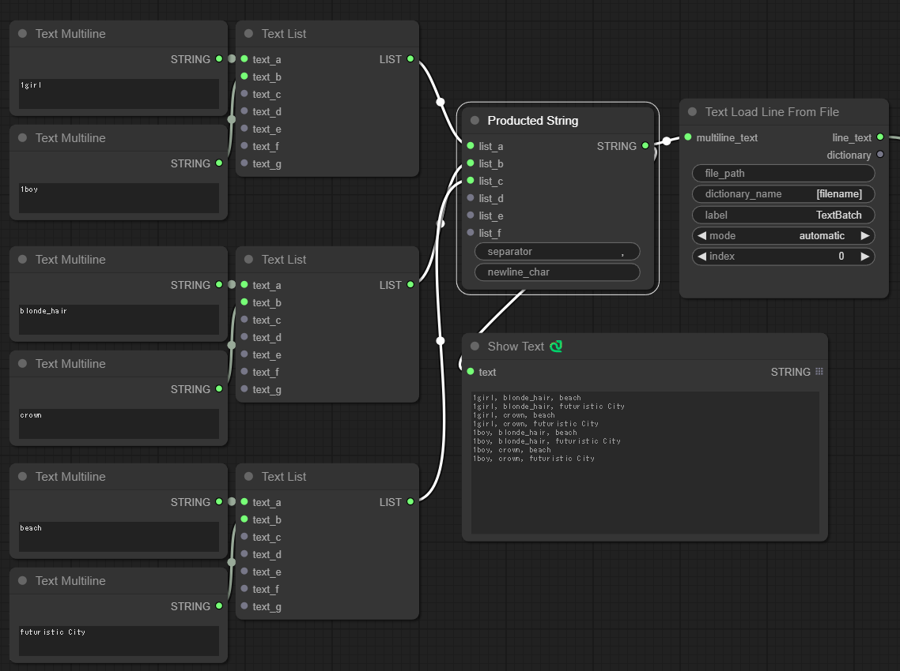
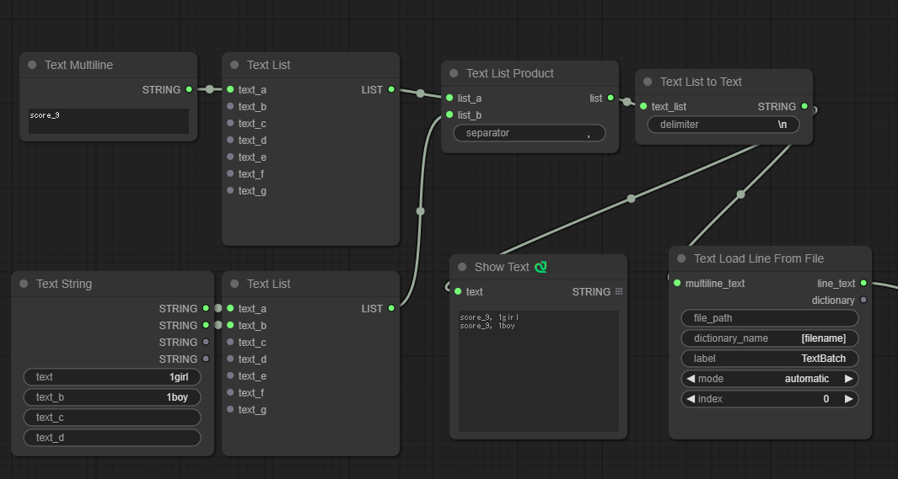
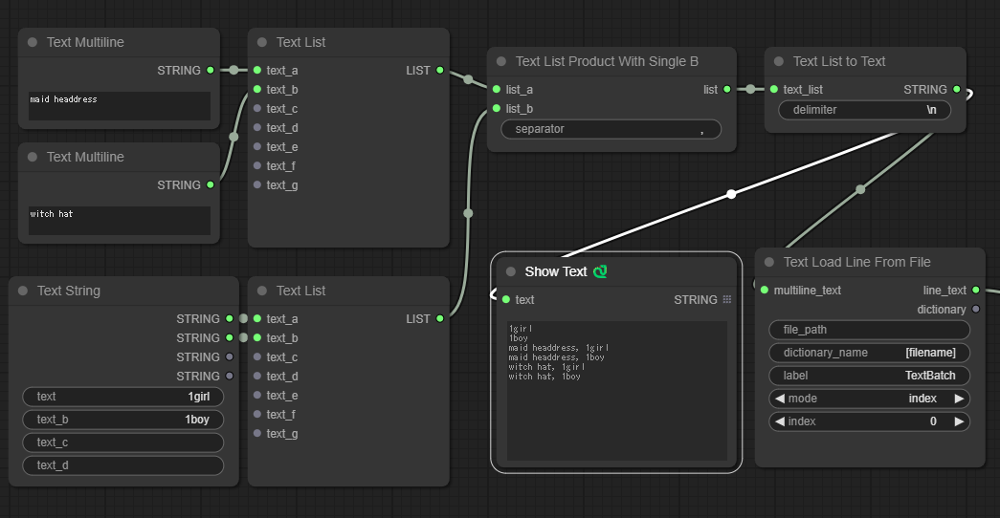
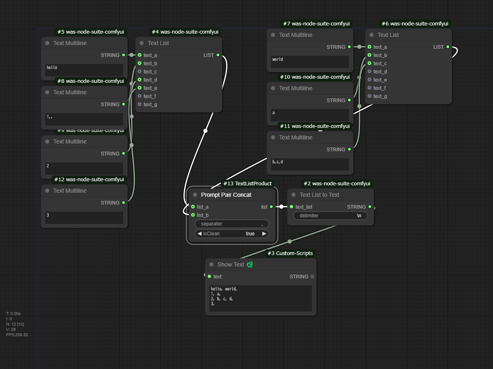
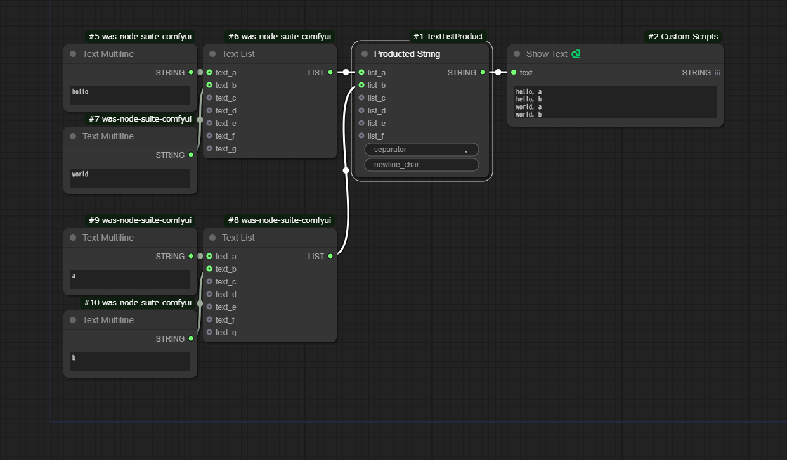

[日本語](#日本語) | [English](#english)

#### english

# Comfy UI Text List Product

This is a custom node for Comfy UI.

It mainly wraps `itertools.product` and can be used to create patterns by combining prompts.

This package includes nodes for creating `LIST` values from strings, so no other custom node suite is required for basic list creation and prompt combination.

In the screenshot above, `[1girl, 1boy]` and `[blonde_hair, crown]` and `[beach, futuristic City]` are combined to create an 8-line (2 * 2 * 2) multiline string. The screenshot also shows an optional workflow using WAS Node Suite nodes.

The [WAS Node Suite](https://github.com/WASasquatch/was-node-suite-comfyui) and [ComfyUI_Comfyroll_CustomNodes](https://github.com/Suzie1/ComfyUI_Comfyroll_CustomNodes) remain compatible optional integrations for file input, saving, and other text utilities.

## Installation

It can be installed via Install Custom Nodes in the [ComfyUI Manager](https://github.com/ltdrdata/ComfyUI-Manager)

## Nodes

### ・ MultilineStringToList

Converts a multiline string into a `LIST`, with one item per line.

- `trim_whitespace` removes whitespace around each line. It is enabled by default.
- `keep_empty_lines` preserves empty lines as empty string items. It is disabled by default.
- Empty input returns an empty list, and comment-like lines are kept as normal text.

For example, entering `red`, `green`, and `blue` on separate lines produces `["red", "green", "blue"]`.

### ・ StringsToList

Collects up to seven connected string inputs (`text_a` through `text_g`) into one `LIST` in input order. Unconnected inputs are skipped, while connected empty strings are preserved.

Use this node when text values already come from separate nodes. It provides a direct replacement for the list-building part of the WAS Node Suite's Text List node.

### ・ TextListToSequence

Converts this package's custom `LIST` value into ComfyUI's sequential `STRING` output. Downstream nodes that normally accept one string are executed once for each list item.

The input must contain at least one item, and every item must be a string. Empty string items are valid and cause one downstream execution with an empty string. An empty list raises a clear error because ComfyUI cannot safely process an empty sequential list.

For sequential prompt generation, connect nodes as follows:

`TextListProduct → Text List to Sequence → CLIP Text Encode`

### ・ TextListProduct

This is a basic node. `TextListProduct` combines two lists and creates a new list joined by the specified separator.

`max_results` can be used to stop generation early when the cartesian product would become too large. `0` means unlimited.

### ・ TextListProductWithSingleA 
### ・ TextListProductWithSingleB
### ・ TextListProductWithSingleBoth

These nodes are shorthand nodes for when you want to use single words from one or both lists.

In other words, it is equivalent to passing an empty string at the beginning of the list passed to TextListProduct.

These nodes also support `max_results` to cap the number of generated combinations.

### ・ ProductedString

This is a further shorthand node for TextListProduct. It combines multiple lists and returns a multiline string with line breaks.

For general use, this node should work well.

`max_results` can be used here as well to cap the number of generated lines.

### ・ PromptPairConcat

Takes two lists of prompts as input and combines each corresponding pair of elements using the specified separator.

`isClean` trims whitespace and removes duplicated separators inside each item before concatenation.

`trailing_separator` optionally appends the separator to the end of each output string for prompt-building workflows.

## Usage Examples

You can use it to add a specified string at the beginning of the strings in the list.

Enter expression patterns, pose patterns, and camera-work patterns in separate `Multiline String to List` nodes, then connect those lists to `Producted String` to generate every combination.

To process each generated combination separately in ComfyUI, use `TextListProduct` instead of `Producted String`, then connect its output through `Text List to Sequence` to a normal string input such as `CLIP Text Encode`.

If needed, the resulting text can still be passed to optional external nodes such as Save Text File from the WAS Node Suite.

## License

MIT

#### 日本語
# Comfy UI Text List Product

Comfy UI のカスタムノードです。

主にitertools.productをラップしたもので、プロンプトをかけ合わせてパターンを作ることに利用できます。

文字列から `LIST` を作るノードも含まれているため、基本的なリスト作成とプロンプトの組み合わせは、ほかのカスタムノード集を追加せずに利用できます。

上のスクリーンショットでは、`[ 1girl, 1boy ]` と `[ blonde_hair, crown ]` と `[ beach, futuristic City ]` を掛け合わせて、8行(2 * 2 * 2)のマルチライン文字列を作っている様子です。この画像には、任意連携の例としてWAS Node Suiteのノードも含まれています。

[WAS Node Suite](https://github.com/WASasquatch/was-node-suite-comfyui)や[ComfyUI_Comfyroll_CustomNodes](https://github.com/Suzie1/ComfyUI_Comfyroll_CustomNodes)は、ファイル入出力、保存、その他のテキスト処理に任意で組み合わせられます。
## インストール

[ComfyUI Manager](https://github.com/ltdrdata/ComfyUI-Manager)のInstall Custom Nodesからインストールできます。

## ノード

### ・ MultilineStringToList

複数行の文字列を、1行につき1要素の `LIST` に変換します。

- `trim_whitespace` は各行の前後空白を除去します。既定で有効です。
- `keep_empty_lines` は空行を空文字列の要素として保持します。既定では無効です。
- 入力が空なら空LISTを返し、コメントのように見える行も通常の文字列として保持します。

たとえば、`red`、`green`、`blue` を別々の行に入力すると、`["red", "green", "blue"]` を返します。

### ・ StringsToList

接続された最大7個の文字列入力（`text_a`～`text_g`）を、入力順に1つの `LIST` へまとめます。未接続の入力は無視し、接続された空文字列は保持します。

文字列が別々のノードから渡される場合に使用します。WAS Node SuiteのText Listノードが担っていたリスト作成部分を直接置き換えられます。

### ・ TextListToSequence

このパッケージ独自の `LIST` を、ComfyUI標準の逐次処理用 `STRING` 出力へ変換します。通常は1つの文字列を受け取る後段ノードが、LISTの各要素について1回ずつ実行されます。

入力には1つ以上の要素が必要で、すべて文字列でなければなりません。空文字列の要素は有効で、後段を空文字列で1回実行します。空LISTはComfyUIが安全に処理できないため、分かりやすいエラーを返します。

プロンプトを逐次処理する場合は、次のように接続します。

`TextListProduct → Text List to Sequence → CLIP Text Encode`

### ・ TextListProduct

基本的なノード。`TextListProduct` は、2つのリストを掛け合わせて、指定されたセパレータで結合した新しいリストを作成します。

`max_results` を使うと、組み合わせ数が大きくなりすぎる場合でも途中で打ち切れます。`0` は無制限です。

#### ・ TextListProductWithSingleA 
#### ・ TextListProductWithSingleB 
#### ・ TextListProductWithSingleBoth

これらのノードは、片方、または両方のリストの単語単体を使いたいときのショートハンド用ノードです。

つまりTextListProductに渡すリストの先頭に空文字を渡した時と同じです。

これらのノードでも `max_results` で生成件数の上限を設定できます。

### ・ ProductedString

さらにTextListProductのショートハンドノードです。複数のリストを掛け合わせて、改行を加えて複数行の文字列にして返します。

とりあえずこれを使えば間違いない。

このノードでも `max_results` を使って出力行数の上限を設定できます。

### ・ PromptPairConcat

2つのプロンプトリストを入力として受け取り、それぞれのリスト要素を指定したセパレータで結合します。zip関数のようなもの。

`isClean` を有効にすると、各要素の前後空白や余分なセパレータを整理してから結合します。

`trailing_separator` を有効にすると、各出力文字列の末尾にセパレータを追加できます。プロンプトを後段で継ぎ足す用途向けです。

## 使用例

リストの文字列の先頭に指定の文字列を加えたいとか。

表情、ポーズ、カメラワークの各パターンを別々の `Multiline String to List` ノードへ入力し、それぞれを `Producted String` へ接続すると、すべての組み合わせを生成できます。

生成した組み合わせをComfyUIで1件ずつ処理する場合は、`Producted String` ではなく `TextListProduct` を使い、その出力を `Text List to Sequence` 経由で `CLIP Text Encode` などの通常の文字列入力へ接続します。

必要であれば、生成した文字列をWAS Node SuiteのSave Text Fileなど、任意の外部ノードへ渡すこともできます。

## Workflow

この画像はWAS Node Suiteとの任意連携例です。LISTの作成自体は、このパッケージの `Multiline String to List` または `Strings to List` だけで行えます。

## License

MIT
